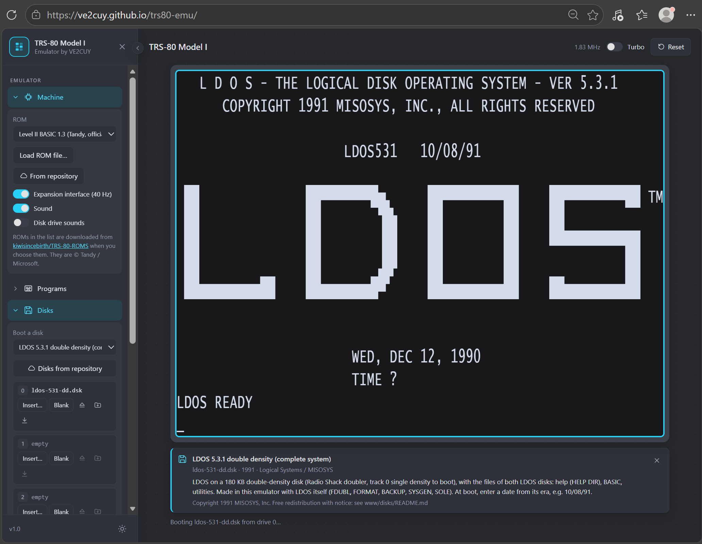

# 🖥️ trs80-emu

🇫🇷 [Version française](README_FR.md)

An emulator of the **TRS-80 Model I**, written in Rust, that runs in a web
browser (WebAssembly).

> Version 1.1: Level II ROM, BASIC, text and semigraphics, `.CMD` programs and
> `.CAS` cassettes, **floppy disks** (LDOS, TRSDOS, NEWDOS...), **sound**, pasting
> text, 40 Hz clock, and **VE2CUY Invaders**, a game written in Z80 assembly for
> this project. New in 1.1: side menu, light and dark themes, four languages, file
> library, external repository, disk drive sounds, tablet keyboard.
> See [docs/conception.md](docs/conception.md) (in French).

**▶️ Try it online: <https://ve2cuy.github.io/trs80-emu/>**

<p align="center">
  
  <br><em>LDOS 5.3.1 double density booted from drive 0, with the side menu and the disk's card.</em>
</p>

## ROMs

No ROM is hosted in this repository: they are © Tandy / Microsoft. The drop-down
list on the page ([`www/roms.json`](www/roms.json)) downloads them, when you choose
one, from the third-party repository
[kiwisincebirth/TRS-80-ROMS](https://github.com/kiwisincebirth/TRS-80-ROMS):

| ROM | Download |
| --- | --- |
| Level II 1.3 and 1.2 (Tandy, official) | Direct, from a pinned commit, SHA-256 checksum verified |
| Level II 1.3 with bug fixes, Enhanced Level II 1.4 (kiwisincebirth) | From their release `.tar` archive, which you download and then open in the page (GitHub does not let the browser download it by itself) |

On the first visit, the emulator starts with Level II 1.3. You can also load your
own file ("Load ROM file…"). Direct link: `?rom=level2-1.3`. The chosen ROM is kept
in your browser.

## Fonts

The "Font" list changes how text is drawn: the original TRS-80 pixel font, or a
fixed-width (monospace) font: retro (VT323, Press Start 2P, ...), modern (IBM Plex
Mono, JetBrains Mono, ...) or installed on your system (Consolas, Courier New).
Fonts are condensed to fit the narrow 64 × 16 grid; semigraphics are unchanged.
Web fonts are downloaded from Google Fonts only when chosen. Direct link:
`?font=vt323`.

## Models

The "Model" list (Machine section) chooses the computer; direct link `?model=3`:

- **Model I**: Level II ROM (12 KB), expansion interface (40 Hz clock, floppy disks).
- **Model III**: 14 KB ROM (Model III rev. C, downloaded from kiwisincebirth/TRS-80-ROMS),
  lowercase, WD1793 floppy controller on ports F0h-F4h with NMI, 30 Hz clock. Tested with
  TRSDOS 1.3.
- **Model 4**: the Model III ROM plus 128 KB of RAM in banks, the four memory maps and the
  80 × 24 screen (port 84h), 4 MHz and 60 Hz clock. TRSDOS 6 / LS-DOS boots in Model 4 mode
  (tested with TRSDOS 6.2.1).
- **Model II** (`?model=2`): a different machine. 2 KB boot ROM (not offered for download: load
  your own with "Load ROM file…"), 64 KB of RAM, 80 × 24 screen with inverse video, ASCII keyboard
  (Ctrl + letter gives control codes, End = BREAK), 4 MHz, 60 Hz clock on NMI, FD1791 controller
  for 8-inch disks served by a Z80 DMA, mode 2 interrupts (DMA, CTC with its timers, PIO, SIO),
  hard disk and RS-232 (see below). Disk images in IMD (ImageDisk) or DMK format. Tested with
  TRSDOS-II 2.0a (it only accepts years 1980 to 1999), TRSDOS-II 4.2 and 4.4 (their boot
  sector tests the memory, DMA, PIO and CTC) and TRSDOS-HD 4.0.

Not emulated yet: Model II 40-column mode; Model 4 sound board and graphics board; the Model III
special characters (C0h-FFh are shown as graphics blocks). Model III and 4 system disks are
not published here (copyright): put yours in `www/disks/local/` with `"model": 2`, `3` or `4`
in `index.json`.

## Interface

- **Side menu**: Machine (ROM, expansion interface, sound, disk drive sounds), Programs,
  Disks, My library, Repository, Display (font, theme), Keyboard, About. On a computer,
  it can be reduced to a column of icons (round button on its edge); on a phone, it is
  a drawer opened with ☰.
- **Light and dark themes**: follows the system by default; choose in Display, or with
  the sun / moon button at the top right.
- **Languages**: English, French, Spanish and Simplified Chinese, chosen with the globe at
  the top right (the browser's language by default). Direct link: `?lang=fr`. Texts are in
  [`www/i18n.js`](www/i18n.js); the program, disk and repository lists can translate their
  fields in `"i18n": { "fr": { "description": "…" } }`.
- **Preferences** (theme, menu, open sections, sound, Turbo, repository...) are kept
  in the browser.
- **Putting a disk in a drive**: the same "Put in…" command everywhere (disks of the Disks
  section, My library, Repository), numbered like the drives: "Drive 0 — boot" restarts the
  TRS-80 on the disk, drives 1 to 3 take data disks, HD1 / HD2 take hard disk images
  (`.hdv`). Choosing a disk in a list only shows its card; nothing starts before "Put in…".
- **Drive bar**: under the screen, what is in drives 0 to 3 and in the hard disks (● : the
  DOS wrote on it), with their geometry (tracks, sides, sectors per track, size, density;
  track 0 when it differs; cylinders and heads of a hard disk). During an access, the
  operation and the track and sector (cylinder, head and sector of a hard disk) show for a
  moment. A click opens the Disks section.
- **Program card**: under the screen, the name of the program or disk being run, with
  its description when known (built-in list, repository, or the name and copyright
  records of a `.CMD` file).
- **Disk drive sounds** (Machine): the motor hum and the steps of the head, synthesized
  from the controller's activity.
- **Drag and drop** a disk, program or BASIC listing onto the screen to run it.

### My library

Disks, programs (`.CMD`, `.CAS`) and BASIC listings (`.BAS`, text or tokenized) can be
kept in the browser (IndexedDB, on this device only; nothing is uploaded): "Add files…",
the "Keep" button of a drive (with the changes made by the DOS) or of the "Type text"
panel, or automatically for the files you open ("Keep the files I open"). From the
library: put a disk in a drive ("Put in…"), Run a program, download or delete.

### Hard disk

The Disks section has two hard disks (HD1 and HD2): the Radio Shack interface, a Western
Digital WD1010 controller on ports C0h-CFh, as supported by the MISOSYS **RSHARD** drivers
and by FreHD cards. Images use the Reed format (`.hdv`) of xtrs, trs80gp and FreHD; "New"
creates an empty 10 MB disk (306 cylinders, 4 heads), "Download" saves it with its files.
The disk stays connected when the TRS-80 restarts or changes between Model I, III and 4.

The DOS needs the RSHARD driver: the disk "RSHARD hard disk drivers" (Disks list, inserted
in drive 1) has RSHARD5/RSFORM5 for LDOS 5.3 and RSHARD6/RSFORM6 for LS-DOS / TRSDOS 6.

```
SYSTEM (DRIVE=2,DISABLE,DRIVER="RSHARD5")    ENTER everywhere, except "partition's number of heads": 4
RSFORM5 :2 (NAME="RIGID1",MPW="PASSWORD")     format (Y), no locked-out track (N)
DIR :2
```

- On the Model I, the driver disk is double density: boot LDOS 5.3.1 double density to read it.
- Keep 4 heads: with 2 heads, RSFORM5 ends with "DATA RECORD NOT FOUND DURING WRITE" (it writes
  to a 3rd head; xtrs behaves the same).
- Not emulated, as in xtrs: multi-sector commands and the controller's DMA (the RSHARD drivers
  do not use them).

Tested with LDOS 5.3.1 on the Model I (double-density disk) and Model III, and TRSDOS 6.2.1
on the Model 4. Save the configuration with `SYSTEM (SYSGEN)` (LDOS 5.3 has no SYSGEN program) or
`SYSGEN` (TRSDOS 6) so that the driver loads at boot, then keep the system disk and the hard
disk in My library (or download them) to keep a copy.

**Session restore** (switch "Keep disks after reload", Machine section, on by default): the
disks and hard disks in the drives, with their changes (SYSGEN, copied files…), are saved in
the browser for each model. When the page is reloaded, or when you come back to that model,
they are put back in the drives and the TRS-80 restarts on drive 0.

**Model II**: the same WD1010 controller, with what the Model II adds: 512-byte sectors, an
interface CTC (ports C4h-C7h) whose channel 0 interrupts at the end of each command, data
moved by the Z80 DMA, and a boot ROM that tries the hard disk before the diskettes. The system
is **TRSDOS-HD** (Tandy, not provided): "New" creates an 8.4 MB disk (256 cylinders, 4 heads);
the boot ROM then shows `BOOT ERROR HN` (unformatted disk): press ESC to boot the TRSDOS-HD
diskette, then `INIT` formats the hard disk (drive 4) and copies the system onto it. The
Model II then boots from the hard disk (`TRSDOS-HD Ready`, `DIR :4`). A Model II hard disk
image does not go to the other models, and vice versa.

### Modem and BBS (RS-232)

The RS-232 serial port (UART on ports E8h-EBh on the Model I, III and 4; port A of the Z80 SIO,
ports F4h-F7h, on the Model II) is connected to a virtual
Hayes modem that reaches BBSes over telnet, through a WebSocket relay
([`server/telnet-relay`](server/telnet-relay/README.md)), since a browser cannot open telnet
connections. The Modem section lists about 850 BBSes (`www/bbs.json`, from
<https://www.telnetbbsguide.com/bbs/list/brief/>): choose one, then **Dial** types
`ATDT host[:port]` on the TRS-80, in LCOMM or COMM. The relay allows the same list.

```
SET *KI KI
SET *CL RS232T (BAUD=2400,WORD=8,PARITY=OFF)               Model III
SET *CL RS232R (BAUD=2400,WORD=8,PARITY=OFF,BREAK=255)     Model I
LCOMM *CL
ATDT bbs.electrodrome.net                                   in LCOMM: CONNECT, then the BBS
```

TRSDOS 6.2.1 (Model 4, 80 columns):

```
SET *CL COM/DVR
SETCOM (BAUD=2400,WORD=8,PARITY=OFF)
COMM *CL
ATDT bbs.electrodrome.net
```


`+++` (with a pause before and after) returns to the modem's command mode, `ATO` goes back
online, `ATH` or the Hang up button (Modem section) ends the call. The modem removes the ANSI
sequences (colors, cursor) that the TRS-80 cannot display (switch in the Modem section). On the
Model I, `BREAK=255` works around a flaw of the LDOS 5.3.1 RS232R driver, which otherwise loses
every received character. Tested with LDOS 5.3.1 (Model I and III) and TRSDOS 6.2.1 (Model 4).

Model II: start a terminal program on channel A (tested with OMNITERM 1.10 on TRSDOS-II 4.2,
not provided), then `ATDT bbs.electrodrome.net`. The line speed comes from the CTC, as on the
real machine: OMNITERM starts at 300 baud (change it in its settings to go faster), and a
program that cannot display as fast as the line receives loses characters, as it would on
the real Model II.

### External repository

Files can come from your device (Load…, Insert…, My library) or from a repository on the
Web, by default `https://ve2cuy.com/trs80`, which can be changed in the Repository section.
It has four folders, `rom/`, `disk/`, `cmd/` and `bas/`, each with an `index.json` listing
its files, in the same format as [`www/disks/index.json`](www/disks/index.json):

```json
[
  { "file": "invaders.cmd", "title": "VE2CUY Invaders", "year": 2026, "authors": "VE2CUY",
    "description": "…", "controls": "Arrows and space", "license": "…" },
  "other.cmd"
]
```

Only `file` is required (a plain file name is also accepted). The server must allow
cross-origin requests (CORS header `Access-Control-Allow-Origin: *`), since the page is
served from another address.

Files are sorted by model: `model` gives the model (1, 2, 3, 4, or a list such as `[3, 4]`)
and the Repository section lists only the files of the chosen model ("All models" shows them
all). The default repository keeps one subfolder per model, named in `file`:

```
rom/index.json    rom/model1/level2.rom    rom/model3/model3.rom    ...
disk/index.json   disk/model1/ldos-531.dsk disk/model2/trsdos20a-m2.imd ...
```

```json
[{ "file": "model3/trsdos13-m3.dsk", "model": 3, "title": "TRSDOS 1.3 (Model III)" }]
```

### Scripts blocked (Brave, NoScript…)

The page needs JavaScript and WebAssembly. When scripts are blocked, the screen explains
what to do, in four languages: in **Brave**, click the lion icon in the address bar and
turn Shields down for the site (or turn off "Block scripts"), then reload. A download
stopped by a content blocker (the ROM, a repository file) is also reported as such.

## Running the emulator locally (release 1.1)

No compilation needed: download the ready-to-run archive and you only need
**Python 3** and a web browser.

1. Download `trs80-emu-1.1.0.zip` from the
   [releases page](https://github.com/ve2cuy/trs80-emu/releases/latest) and unzip it.
2. Start it:
   - **Windows**: double-click `start.bat`;
   - **macOS / Linux**: `./start.sh` in a terminal;
   - **any system**: `python serve.py` in the folder, then open <http://localhost:8080>.
3. The page opens; the Level II 1.3 ROM is downloaded automatically the first time
   (or copy your own ROM to `rom/level2.rom` to work offline).

To stop it, close the server window (or press Ctrl+C). Details, including your own
disks in `disks/local/`: `README-LOCAL.md`, in the archive
([dist/README-LOCAL.md](dist/README-LOCAL.md)).

## Building from source

Prerequisites (once):

```bash
rustup target add wasm32-unknown-unknown
cargo install wasm-pack
```

Build, then serve the `www/` folder:

```bash
wasm-pack build crates/web --target web --out-dir ../../www/pkg --no-pack
cd www
python serve.py        # no caching; or: python -m http.server 8080
```

Open <http://localhost:8080>, choose a ROM in the list (or your own file), then
answer `MEM SIZE?` with ENTER.

- A local server is required: browsers refuse to load a WebAssembly module
  opened directly from `file://`.
- During development, a ROM copied to `www/rom/level2.rom` (ignored by Git) is
  loaded automatically.

### Programs

- **Built-in list**: VE2CUY Invaders ([source](asm/invaders.asm)) and games whose
  author allowed redistribution (Sea Dragon, Armored Patrol). Read
  [www/programs/README.md](www/programs/README.md) (in French) before adding one.
- **"Load program (.CMD, .CAS, .BAS)…"**: any program from your disk; nothing is uploaded.
  A cassette (`.CAS`) is loaded directly into memory: a machine-language tape is
  started, a BASIC tape is run.
- **Copy and paste**: Ctrl+V on the screen, the Paste button of the toolbar, or "Type
  text…", types the text on the TRS-80 keyboard (for example a BASIC program or DOS
  commands). Ctrl+C on the screen (nothing selected in the page), or the Copy button,
  copies the screen text.
- Direct link to a program: `?program=ve2cuy-invaders`.

TRSDOS file calls are replaced by minimal routines: programs made for floppy disk
start, but nothing is saved.

### Disks

- **"Disks for this model"**: LDOS 5.3.1, freely redistributable, in single density and as a complete
  double-density system (see [www/disks/README.md](www/disks/README.md)).
  At boot, enter a date from its era, e.g. `10/08/91`. Direct link: `?disk=ldos-531`.
- **Local disks** (development): disks you may not publish (e.g. TRSDOS) go in
  `www/disks/local/`; this folder is ignored by Git and its disks appear in "Boot a
  model" marked "local" (with `python serve.py`).
- **Disk lists**: after adding or removing images in `www/disks/` or `www/disks/local/`,
  run `python www/disks/make_index.py`. It updates both `index.json` files (new images
  get an entry, entries of missing images are removed, existing titles and
  descriptions are kept). Only put images you may redistribute in `www/disks/`.
- **Drives 0 to 3**: "Insert…" any JV1, JV3, DMK or IMD image, "Blank" for an unformatted disk
  (format it from the DOS, e.g. `FORMAT :1`), "Eject", and "Save" to download the disk
  (a reformatted disk or a DMK or IMD image is saved as JV3). Drive 0 is the boot drive: inserting a disk
  there restarts the TRS-80 on it.
- WD1771 controller of the Model I expansion interface, plus the **Percom and Radio
  Shack double-density doublers** (WD1791). Tested: LDOS 5.3.1, TRSDOS 2.1, 2.3 and
  2.7DD, NEWDOS 3.0, NEWDOS/80, DOSPLUS 3.5, DBLDOS 4.2. Formatting works. As on the real
  machine, a disk whose track 0 is double density cannot boot.

### Sound

The Model I has no sound chip: programs toggle the cassette output (port FFh), as
VE2CUY Invaders does. The emulator turns it into audio (WebAudio). Sound starts at
the first key press or click (a browser rule); untick "Sound" to mute.

### Keyboard

| TRS-80 | PC |
| --- | --- |
| ENTER | Enter |
| BREAK | Esc or End |
| CLEAR | Home or Delete |
| ← (backspace) | Backspace or Left arrow |
| → (tab) | Tab or Right arrow |

Type symbols as you would on a PC (`"`, `*`, `+`, ...): the emulator handles the
TRS-80 Shift key, whose layout is different.

On a tablet or phone, tap the screen (or "⌨ Keyboard") to show the on-screen keyboard;
buttons under the screen give BREAK, CLEAR, the arrows and ENTER.

Model II: its CAPS key starts pressed, since TRSDOS-II only accepts commands in upper case
(`dir` gives `ERROR 31`); Caps Lock toggles it, to type lower case in a terminal program.

### Z80 assembler

The `</>` button at the top right opens a development environment next to the TRS-80 screen:

- **Editor** with syntax colors and line numbers. Syntax of the assemblers of the time
  (EDTASM, zmac): labels in column 1 or ending with `:`, `ORG`, `EQU`, `DB`/`DEFB`,
  `DW`/`DEFW`, `DS`/`DEFS`, `END start`; numbers `4467H`, `0x4467`, `$4467`, `%1010`, `'A'`.
  All documented Z80 instructions; the output is identical to zmac's (tested on every
  instruction and on VE2CUY Invaders).
- **Assemble** (F9): each error is explained, and a **Fix** button proposes the corrected
  line when it can: misspelled instruction or symbol, hexadecimal number without a leading
  digit (`FFH` → `0FFH`), `JR` too far (→ `JP`), invalid operands (with the valid forms),
  Model III address of an LDOS service, missing `ORG`...
- **LDOS services** without definitions: `CALL @DSPLY`, `@TIME`, `@DATE`, `@EXIT`, `@KEY`,
  file services (`@FSPEC`, `@INIT`, `@OPEN`, `@READ`, `@WRITE`, `@CLOSE`...) and ROM routines
  are predefined, with the addresses of LDOS 5.3.1 on the Model I (verified by the tests
  under LDOS). The list is in the environment; a program's own `EQU` takes precedence.
- **Run** (F5) or **Debug**: the program is loaded and started like a DOS command; its `RET`
  or `JP @EXIT` returns to LDOS (or to BASIC without a disk). Click a line number to set a
  **breakpoint**; **Step** (F10) runs one instruction and steps over calls to LDOS and the
  ROM. The **registers**, flags, the stack and the bytes at PC and (HL) are shown at each step.
- **Open / Save** on the disk of the chosen drive: `NAME/ASM` (source, also EDTASM format
  when reading) and `NAME/CMD` (program, runnable from LDOS: `NAME`). The single-density
  LDOS system disk is full: use the double-density one, or a data disk.

## Structure

| Folder | Role |
| --- | --- |
| `crates/z80` | `no_std` Z80 core: reusable natively, in WebAssembly or on a microcontroller |
| `crates/z80asm` | `no_std` Z80 assembler: diagnostics with fixes, `.CMD` output, LDOS symbols |
| `crates/trs80` | The machine (`no_std`): memory map, keyboard, video, disks, LDOS files, debugger |
| `crates/web` | WebAssembly binding (`wasm-bindgen`) |
| `www/` | The web page: `index.html`, `main.js` (emulator), `ide.js` (assembler), `i18n.js`, `style.css` |
| `www/programs/` | Freely redistributable programs and their list (`index.json`) |
| `asm/` | Z80 assembly sources (VE2CUY Invaders), built with zmac |
| `dist/` | Release packaging (`package.py`), launchers and local instructions |
| `docs/` | Design notes (in French) |

## Tests

```bash
# Quick tests: Z80 instructions, ROM boot, BASIC session (if a ROM is present)
cargo test

# Full Z80 validation (ZEXDOC and ZEXALL): about 30 seconds
cargo test --release -p z80 --test zex -- --ignored --nocapture
```

The tests that boot the Level II ROM expect it in `crates/trs80/tests/roms/`.
It is **not included** (Tandy / Microsoft copyright): see
[crates/trs80/tests/roms/README.md](crates/trs80/tests/roms/README.md) (in French).

## License

[Apache License 2.0](LICENSE). Third-party files (ZEXDOC/ZEXALL, the public-domain
games, LDOS) keep their own terms: see [NOTICE](NOTICE). TRS-80 ROMs are not included.

## Author

Alain Boudreault (VE2CUY) — [ve2cuy.github.io](https://ve2cuy.github.io/)
